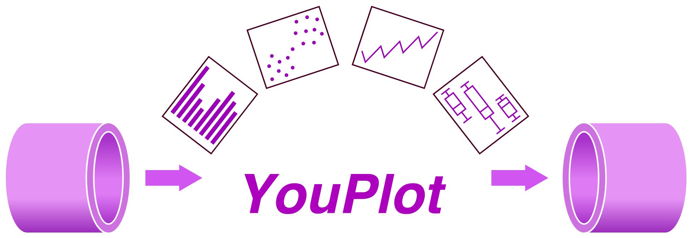

# YouPlot2

<div align="center">
  
  <hr>
  <a href="https://github.com/red-data-tools/YouPlot2/actions/workflows/build.yml"></a>
  <a href="https://tokei.kojix2.net/github/red-data-tools/YouPlot2"></a>
  <a href="LICENSE"></a>
  
  <p><a href="https://github.com/red-data-tools/YouPlot2">YouPlot2</a> is a portable version of <a href="https://github.com/red-data-tools/YouPlot">YouPlot</a>.</p>

  <p>:crystal_ball: Powered by <a href="https://github.com/crystal-lang/crystal">Crystal</a></p>
</div>

## Installation

Download the binary from the [GitHub Releases](https://github.com/red-data-tools/YouPlot2/releases).

- Prebuilt portable binaries are available.
- Linux and Windows builds are statically linked.
- macOS builds are distributed as portable precompiled executables.
- YouPlot2 is intended for environments where installing additional dependencies is difficult.

## Usage

See [YouPlot](https://github.com/red-data-tools/YouPlot).

## Development

```sh
git clone https://github.com/red-data-tools/YouPlot2
cd YouPlot2
shards build
bin/uplot2 --version
```

Dependency:
[unicode_plot.cr](https://github.com/crystal-data/unicode_plot.cr)
